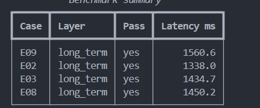
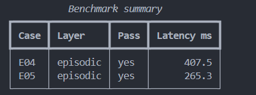
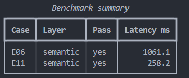
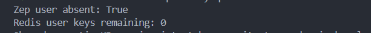

# Benchmark submission

## Phân tích benchmark

`reports/benchmark.json` ghi nhận 11/11 case pass, memory hit rate 100.0%, latency trung bình 815.8 ms và token reduction trung bình 14.19%. Không có layer nào có hit rate thấp nhất: short-term (E01, E10), long-term (E02, E03, E08, E09), episodic (E04, E05) và semantic (E06, E11) đều đạt 100%.

Query lấy nhiều token nhất là E03 (open loop/deadline của Minh), 1,406 token. E07 cần kết hợp long-term và semantic: evidence bắt buộc là preference Python cho demo cá nhân ORCHID-27 và quy tắc PAYMENT-RULE-3 (giữ cùng Idempotency-Key, retry hợp lệ).

So với full source context, reduction trung bình là 14.19%. No-memory đạt 81.82% reduction nhưng hit rate chỉ 18.18% (2/11), vì gần như bỏ toàn bộ evidence; giảm token không có giá trị nếu câu trả lời sai.

## Reflection

Layer quan trọng nhất là long-term, thể hiện ở E02/E03/E08/E09 (4 case cross-session); thiếu nó sẽ mất preference, deadline và constraint theo project. Zep Context Block tiện cho summary/facts có validity và scope, nhưng latency/chi phí cao hơn; Redis + Qdrant cho kiểm soát local, truy vấn nhanh và chi phí predictable, đổi lại phải tự quản lý indexing, recency và conflict.

Guardrail: scope truy vấn theo `user_id`/`graph_id`, cap query, chỉ đọc retrieval trong flow; không có background write tự cấp quyền. Evidence cần marker/validity để chống memory poisoning và không biến dữ liệu không kiểm chứng thành constraint.

E08 cho thấy recency phải scope-specific: BLUEBIRD-42 dùng TypeScript/NestJS dù preference cá nhân vẫn là Python cho ORCHID-27. E10 cho thấy compaction phải giữ durable constraint `REVIEW-DEADLINE-1600` trong summary/notes, dù các filler turns bị rút gọn.

## Evidence

- 
- 
- 
- 
